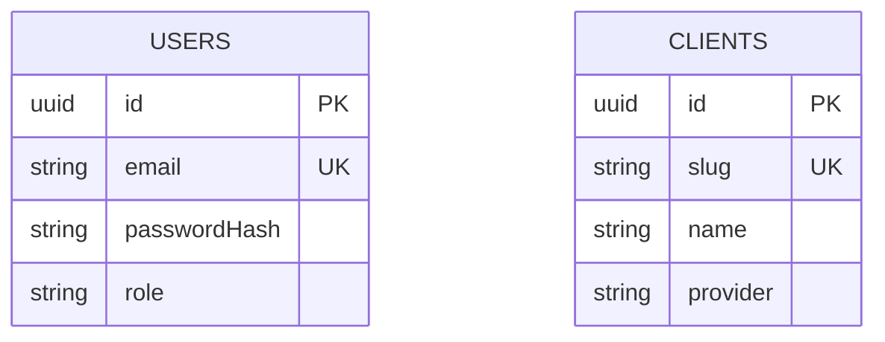

**Processo Seletivo 2025 – API (NestJS)**

- Login via `POST /auth/login` com `{ email, password }` (seed: `admin@in8.com.br` / `admin123`).
- Whitelabel por cliente: tabela `clients` com `slug` (host) e `provider` (`brazilian` ou `european`).
- Produtos: `GET /products` e `GET /products/:id` consultam fornecedor com base no host (`Host` header) ou `?client=`.
- Banco: SQLite (`data.db`) com `users` e `clients`. `synchronize: true` para facilitar.

**Endpoints**
- `POST /auth/login` → retorna `accessToken` (JWT).
- `GET /clients` → lista clientes whitelabel.
- `GET /products?search=...&client=slug` → lista produtos filtrando por `search`.
- `GET /products/:id?client=slug` → produto por ID.

**Fornecedores**
- Brasileiro: `http://616d6bdb6dacbb001794ca17.mockapi.io/devnology/brazilian_provider`
- Europeu: `http://616d6bdb6dacbb001794ca17.mockapi.io/devnology/european_provider`

**Whitelabel (DNS local)**
- Edite `C:\Windows\System32\drivers\etc\hosts` e adicione:
  - `127.0.0.1 brazil.in8.local`
  - `127.0.0.1 europe.in8.local`
- Ao acessar com `Host: brazil.in8.local`, a API usa o fornecedor brasileiro; com `Host: europe.in8.local`, usa o europeu.

**Arquitetura**
- Módulos: `Auth`, `Users`, `Clients`, `Products`.
- `ProductsService` resolve o fornecedor via `ClientsService` usando `Host` ou `?client=`.

**Como rodar**
- `npm run start:dev` (dev com ts-node-dev) ou `npm run build && npm run start`.

**DER (simplificado)**

Documentação adicional e collection estão em `docs/` e `postman/`.
