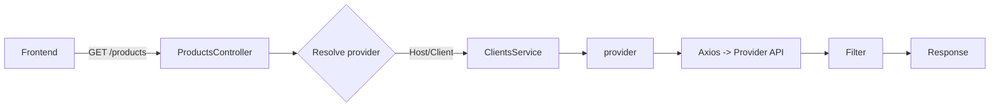

**Arquitetura da API (NestJS)**

- Camadas:
  - `AuthModule`: autenticação JWT simples (sem guards por enquanto).
  - `UsersModule`: serviço de usuários com seed.
  - `ClientsModule`: whitelabel por host/subdomínio.
  - `ProductsModule`: proxy para fornecedores com filtro.

- Fluxo de Produtos:
  - Controller lê `Host` e/ou `?client=`.
  - Service determina `provider` via `ClientsService`.
  - Faz `axios` para o fornecedor e aplica filtro local.

